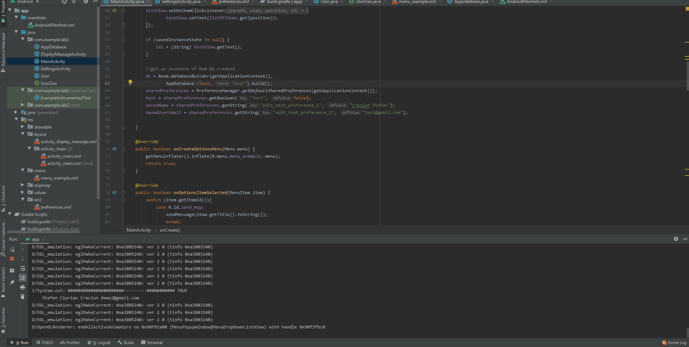

# android-lab5

Android app - lab5

Am create in `app\src\main\res\xml\preferences.xml` un fisier xml unde pun un User si un Email, o clasa `SettingsActivity` - `D:\Android\android-lab5\app\src\main\java\com\example\lab2\SettingsActivity.java`

Pentru partea a 2 -a am folosit `Room Persistence Library` ca fisiere am `AppDatabase` , `User` si `UserDao`, iar ca sa fac partea de save info to DB am pus un buton cu Save Settings in menu si fac insert cu nume si email.

Am atasat si un gif cu flow-ul complet:

